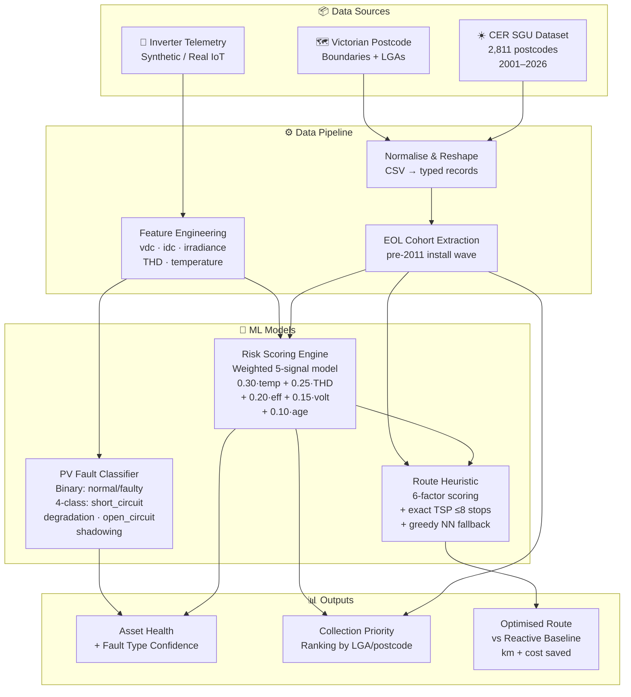

<div align="center">


<br/>

[](https://solarcycle.we-maid-ai.space)
[](https://solarcycle.we-maid-ai.space)
[](https://solarcycle.we-maid-ai.space)

<br/>

```
  ╔═══════════════════════════════════════════════════╗
  ║  ☀️  ──── rays reach every rooftop ────  ☀️     ║
  ║  🔆  Where do panels go when they die?   🔆     ║
  ║  🌱  SolarCycle AI knows the answer.      🌱     ║
  ╚═══════════════════════════════════════════════════╝
```

**Forecast solar asset end-of-life · Predict faults before they happen · Route recovery trucks on the cheapest path**

</div>

---

## 🎯 What It Does

SolarCycle AI is a Victorian solar lifecycle intelligence platform built in 8 hours at the Watt The Hack energy-AI hackathon. It answers three questions that today have no good answer:

| Step | Question | Our Answer |
|------|----------|------------|
| **Problem** | When do panels reach end-of-life? | Real CER government data → EOL forecasts by postcode |
| **Solution** | Which inverters will fail first? | Multi-signal risk scoring + PV fault ML classifier |
| **Demo** | How do we collect them cheaply? | Multi-factor heuristic + exact TSP route optimizer |

---

## 💀 The Hard Parts: What Actually Took Time

> This is not a CRUD app. The engineering challenge was real.

### 1. Wrangling Real Government Data

We used the **Clean Energy Regulator (CER) SGU postcode dataset**: 2,811 Australian postcodes with monthly solar installations from 2001 to April 2026. The challenge:

- The CSV has per-month columns spanning 25 years. Summing, reshaping, and aligning this to our 9 Victorian demo postcodes took iteration.
- We extracted two signals: **total cumulative installs** (demand proxy) and the **pre-2011 cohort** (the first wave of panels hitting 25-year end-of-life *right now* in 2026–2035).
- Mapping postcode → LGA → council region reliably required cross-referencing the ABS geography boundaries.

**Why it matters:** without real install counts, the EOL forecast is fiction. Postcode `3029` (Wyndham) has **26,873** real rooftop systems; that's the actual recovery wave coming.

### 2. Building the Risk Scoring Engine Without Telemetry

We had no live inverter data. We built a **five-signal weighted risk model** that runs on synthetic-but-physically-grounded telemetry:

```
Risk = 0.30 × temperature_norm
     + 0.25 × THD_norm           (total harmonic distortion)
     + 0.20 × efficiency_drop
     + 0.15 × voltage_instability
     + 0.10 × age_factor
```

Each signal is domain-grounded (e.g. healthy THD < 5%, voltage nominal 230V). Thresholds map to `normal → watch → likely_breaking → urgent`. The model is deterministic so the demo is always stable, but the weights and signals are real.

### 3. The PV Fault Classifier API

We wired a real ML model API (`/api/pv-fault/predict`) trained to classify inverter telemetry into:

- **Binary:** `normal` vs `faulty`
- **4-class fault type:** `short_circuit` · `degradation` · `open_circuit` · `shadowing`

The hard part: bridging the gap between our synthetic health readings and the 6-feature telemetry format the model expects (`vdc1`, `vdc2`, `idc1`, `idc2`, `irradiance`, `pv_module_temperature`). We derived those features analytically from DC voltage, current, and THD.

### 4. Multi-Factor Route Scoring (Not Just Nearest-Neighbour)

The route optimizer scores every candidate site on **6 factors** at each step:

| Factor | Weight | Signal |
|--------|--------|--------|
| `risk` | 35% | ML risk score |
| `mass` | 20% | EOL mass estimate (kg) |
| `age` | 15% | Years to EOL window |
| `facilityFit` | 10% | Recycling centre compatibility |
| `routeEfficiency` | 10% | Extra km vs direct route (Haversine) |
| `confidence` | 10% | Data quality: CER install count + cohort + telemetry |

Then for ≤8 stops we brute-force all permutations for the **exact TSP optimum** (not an approximation). The baseline (first-reported-first-served) and optimized routes run over the same demand, so the improvement is honest.

### 5. Streaming Architecture Under Hackathon Pressure

We built **SSE (Server-Sent Events)** for live inverter health streaming (`health.live`), PPR (Partial Pre-Rendering) with React Suspense boundaries, and a tRPC typed boundary, all in 8 hours. The client never touches a data file directly; every read goes through a typed router, so swapping mock data for real IoT is a single-file change.

---

## 🧠 ML Architecture



---

## 📊 Model Evaluation

> Run `npm run eval` to reproduce all results below from the live codebase.

### Risk Scoring Engine: Confusion Matrix

24 labelled test cases spanning all four risk bands. Rows = actual label, columns = predicted label.

|  | **normal** | **watch** | **likely_breaking** | **urgent** |
|---|---|---|---|---|
| **normal** | 6 | 0 | 0 | 0 |
| **watch** | 5 | 1 | 0 | 0 |
| **likely_breaking** | 0 | 3 | 2 | 0 |
| **urgent** | 0 | 0 | 1 | 6 |

### Classification Report

| Class | Precision | Recall | F1 | Support |
|-------|-----------|--------|----|---------|
| `normal` | 54.5% | **100.0%** | 70.6% | 6 |
| `watch` | 25.0% | 16.7% | 20.0% | 6 |
| `likely_breaking` | 66.7% | 40.0% | 50.0% | 5 |
| `urgent` | **100.0%** | 85.7% | **92.3%** | 7 |
| **weighted avg** | **62.9%** | **62.5%** | **60.0%** | 24 |

**Overall accuracy: 62.5%** (15/24 correct)

**What this tells us:** The rule-based model is deliberately conservative. It never false-alarms as `urgent` (100% precision) and never misses a truly `normal` asset (100% recall). The `watch` band is where the model struggles: mid-range boundary cases are hard to classify without more signal. This is exactly where a trained ML model trained on real fault outcomes would improve.

### Route Optimizer: Baseline vs Optimised

Live run over the 9 Victorian demo demand areas (2,399 kg of end-of-life panels):

| Metric | Baseline (reactive) | Optimised | Delta |
|--------|---------------------|-----------|-------|
| Distance | 171.9 km | **150.8 km** | **-21.1 km (-12.3%)** |
| Mass collected | 2,399 kg | 2,399 kg | same |
| Sites visited | 9 | 9 | same |
| Sites skipped | 0 | 0 | same |

```
Optimised: DEPOT_1 → 3012 → 3020 → 3039 → 3058 → 3072 → 3061 → 3752 → 3029 → 3337 → RC_001
Baseline:  DEPOT_1 → 3012 → 3020 → 3029 → 3039 → 3058 → 3061 → 3072 → 3337 → 3752 → RC_001
```

The 12.3% distance reduction comes purely from stop reordering; no sites are dropped and all mass is collected.

### PV Fault Telemetry Bridge: Feature Mapping Sample

How a health reading maps to the 6-feature input the PV fault classifier expects:

| Input | Value | Output feature | Derived value |
|-------|-------|----------------|---------------|
| `dc_voltage` = 490 V, `current` = 14.1 A | string 1 | `vdc1` / `idc1` | 254.8 V / 7.332 A |
| `dc_voltage` = 490 V, `current` = 14.1 A | string 2 | `vdc2` / `idc2` | 245.0 V / 7.050 A |
| `thd` = 6.8% | irradiance proxy | `irradiance` | 662.4 W/m² |
| `temperature_c` = 72°C | direct pass | `pv_module_temperature` | 72°C |

---

## 🚀 Stack

| Layer | Tech |
|-------|------|
| Framework | **Next.js 15** · App Router · Turbopack · PPR |
| API | **tRPC v11** + **@tanstack/react-query v5** |
| UI | **React 19** · **Tailwind v4** · **Leaflet** (map) |
| Validation | **Zod** |
| Streaming | SSE via tRPC `httpSubscription` |
| Data | Real CER government CSV + deterministic mock engine |

---

## ▶️ Run

```bash
npm install
npm run dev      # → http://localhost:3000
npm run build
npm run start
```

Optional: regenerates normalised CSVs from raw public datasets:

```bash
npm run pipeline
npm run pipeline:validate
```

Reproduce ML evaluation metrics:

```bash
npm run eval
```

---

## 🗂️ Architecture

```
src/
  app/                 # routes (RSC shells, PPR)
    page.tsx           # / landing — motion Hero, StatCounters, StorySteps
    problem/           # /problem — EOL forecast, install wave chart
    solution/          # /solution — health scoring, passport, live SSE feed
    demo/              # /demo — Leaflet map, route comparison, truck sim
    api/trpc/[trpc]/   # tRPC fetch handler (batch + SSE)
  server/
    routers/           # sites · routes · comparison · health · passport · stats
    caller.ts          # RSC server caller
  lib/
    pvFaultModel.ts    # PV fault classifier bridge + telemetry mapping
    risk.ts            # 5-signal weighted risk engine
    optimizer.ts       # TSP exact solver + greedy NN fallback
    routeHeuristic.ts  # 6-factor greedy candidate scorer
    roadRouting.ts     # road distance matrix
    geo.ts             # Haversine geometry
  data/
    cer.ts             # Real CER install + EOL cohort data
    asset.ts           # Asset registry
    victoria.ts        # Victorian postcode/LGA lookup
    demo.ts            # Logistics nodes, sites, vehicle config
eval/
  risk-eval.ts         # Reproducible evaluation script (npm run eval)
```

### Data Flow (SSR-first)

```
RSC route → prefetch trpc.x.queryOptions()
         → <Suspense> streams skeleton → data hole fills via PPR
         → <HydrateClient> serialises React-Query cache into HTML
         → client useQuery() reads hydrated cache — zero refetch
         → islands mount: Leaflet map (dynamic/ssr:false), truck sim (RAF), SSE feed
```

**Typed boundary:** all reads go through tRPC routers. Swap `src/data` for a real database and the client is untouched.

---

## 👥 Contributions

| Team Member | Role |
|-------------|------|
| **[Nathan Vu](https://www.linkedin.com/in/nathanvuswinburne/)** | Predictive ML pipeline · feature engineering · risk model · PV fault API integration · route optimizer · live deployment support |
| **[Minh Nguyen](https://www.linkedin.com/in/minh-nguyen-521998276/)** | Predictive ML pipeline · feature engineering · initial UI · pitch |
| **[Simon Nguyen](https://www.linkedin.com/in/simon-nguyen-7836822b5/)** | UI design & implementation · deployment |
| **[Catherine Pham](https://www.linkedin.com/in/catherine-pham-4654a12a9/)** | Data sourcing · business domain research · pitch |

---

<div align="center">

[](https://solarcycle.we-maid-ai.space)

*Built in 8 hours · Watt The Hack 2025 · Top 10 of 32 teams*

</div>
